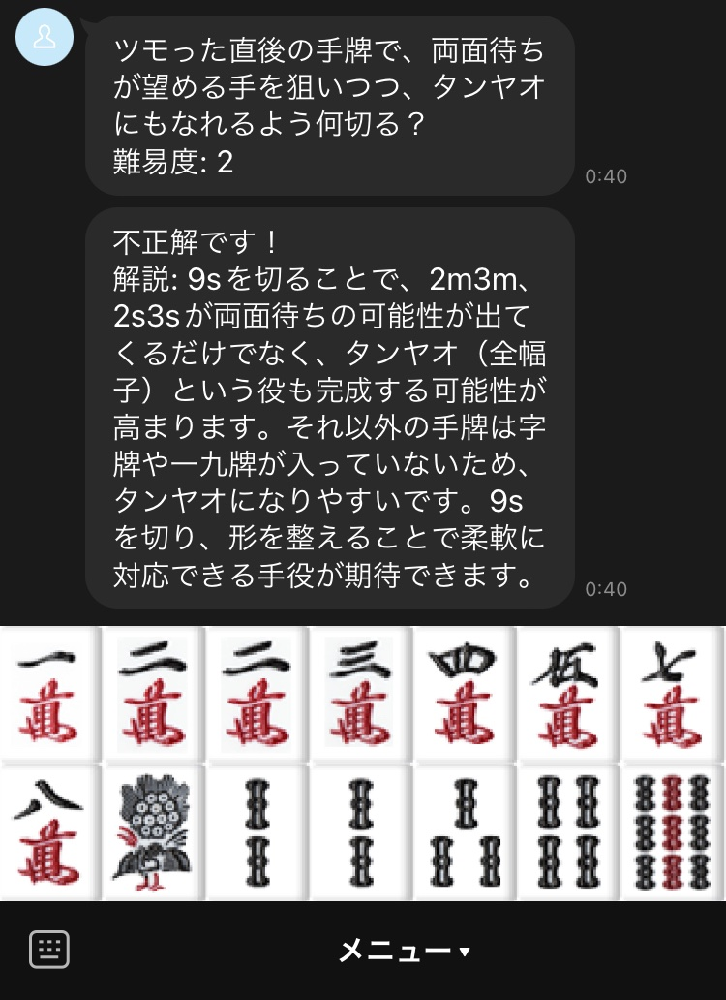

# Mahjong GPT LINE Bot

This application is designed to generate questions that answer which mahjong tiles to discard using
ChatGPT, which can then be unpacked by LINE Bot.



This is a test implementation and will not withstand actual operation.

The following site was used for the Mahjong tile images. Since they are not redistributed, they must
be properly extracted under the `img/` directory.

* [https://mj-king.net/sozai/](https://mj-king.net/sozai/)

## Set up config

Create a configuration file in `config/local.yaml` as follows. The Rich Menu ID should be left blank
as a default rich menu must be created first.

```yaml
logging:
  log_file_name: log/app.log

database:
  name: database.db

gpt:
  token: xxx # ChatGPT Token
  model: gpt-4
  temperature: 1.0
  max_tokens: 500
  n: 1

line_bot:
  channel_access_token: xxx
  channel_secret: xxx
  default_rich_menu_id: xxx
  default_rich_menu_img_path: img/button.png
```

Run richmenu.py with the LINE token set to create a rich menu, and reflect the results in the
configuration file.

```sh
python richmenu.py
```

## Run Server

The following commands can be used.

```sh
python main.py
```

## Caution

Note that various image files must be placed for startup.